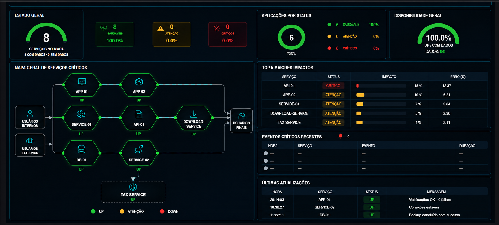
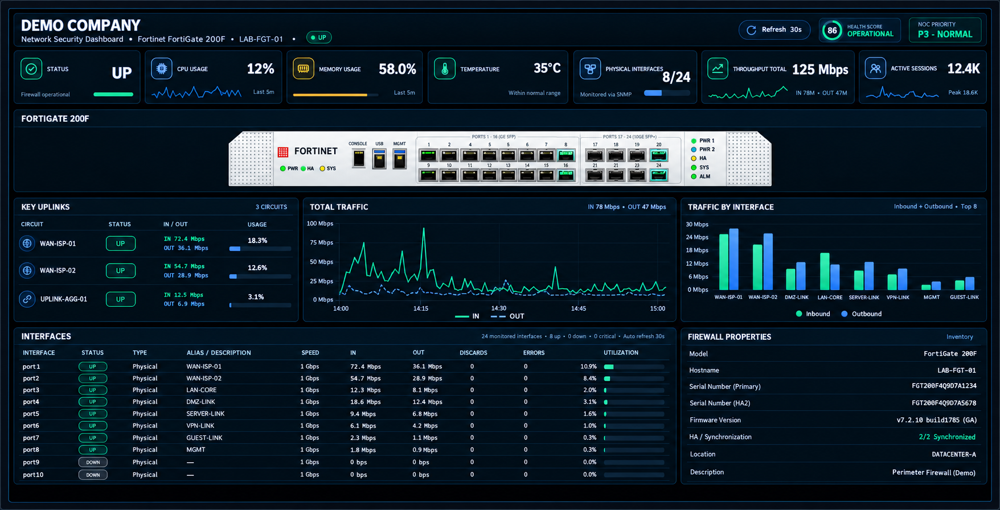
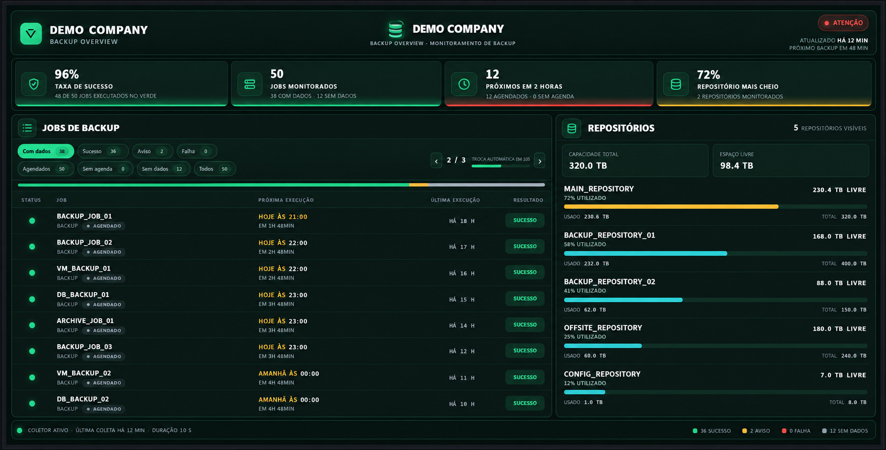

# Grafana Observability Portfolio

Portfolio of Grafana dashboards focused on **infrastructure monitoring, NOC operations, backup observability, network visibility and operational dashboards**.

> **Public demo repository:** all organization-specific names, hostnames, IP addresses, dashboard/datasource UIDs, logos, internal application names and authentication material were removed or replaced with fictional values before publication.

## Featured Dashboards

### Critical Services Observability



Multi-source monitoring dashboard using **Grafana, Zabbix and Elasticsearch/APM** for critical-service health, operational visibility, state mapping and partial-data handling.

[View project](dashboards/critical-services-observability/)

---

### FortiGate Health Monitoring



Network and firewall observability dashboard using **Grafana and Zabbix**, with visibility into device health, HA status, CPU, memory, temperature, sessions, interfaces and traffic.

[View project](dashboards/fortigate-monitoring/)

---

### Veeam Backup Monitoring



Backup operations dashboard using **Grafana, Prometheus and Veeam metrics** to monitor job status, scheduling, repositories, capacity and collector health.

[View project](dashboards/veeam-backup-monitoring/)

---

## Projects

| Dashboard | Main technologies | What it demonstrates |
|---|---|---|
| [Critical Services Observability](dashboards/critical-services-observability/) | Grafana, Zabbix, Elasticsearch/APM, HTML Graphics | Multi-source service-health logic, partial-data handling, state mapping, custom UI and drill-down patterns |
| [FortiGate Monitoring](dashboards/fortigate-monitoring/) | Grafana, Zabbix, FortiGate | Firewall health, HA status, CPU/memory/temperature, sessions, interfaces and traffic |
| [Veeam Backup Monitoring](dashboards/veeam-backup-monitoring/) | Grafana, Prometheus, Veeam | Backup job status, next/last run, repository capacity and collector health |
| [Palo Alto Monitoring](dashboards/palo-alto-monitoring/) | Grafana, Zabbix, Palo Alto Networks | Firewall availability, resource health, interface state, throughput and custom visualization |
| [NOC Ticket Queue](dashboards/noc-ticket-queue/) | Grafana, Zabbix, Jira, Infinity | Unified operational view of monitoring events and service-management queues |

## Skills Demonstrated

This portfolio demonstrates practical experience with:

- **Grafana dashboard design and customization**
- **Zabbix monitoring and datasource integration**
- **Prometheus metrics and operational telemetry**
- **Infrastructure and network observability**
- **Backup monitoring and Data Protection operations**
- **HTML Graphics, JavaScript, CSS and SVG**
- **NOC-oriented monitoring interfaces**
- **Operational status and health visualization**
- **Dashboard sanitization for safe public sharing**

## Repository Structure

```text
grafana-observability-portfolio/
├── README.md
├── SECURITY.md
├── docs/
│   ├── IMPORTING.md
│   └── SANITIZATION.md
└── dashboards/
    ├── critical-services-observability/
    │   ├── README.md
    │   ├── dashboard.sanitized.json
    │   └── screenshots/
    │       └── critical-services-preview.png
    │
    ├── fortigate-monitoring/
    │   ├── README.md
    │   ├── dashboard.sanitized.json
    │   └── screenshots/
    │       └── fortigate-preview.png
    │
    ├── veeam-backup-monitoring/
    │   ├── README.md
    │   ├── dashboard.sanitized.json
    │   └── screenshots/
    │       └── veeam-backup-preview.png
    │
    ├── palo-alto-monitoring/
    └── noc-ticket-queue/
