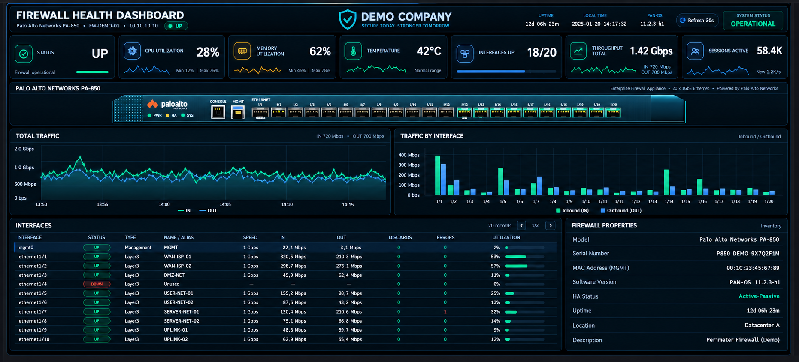

# Palo Alto Firewall Health Monitoring Dashboard

A Grafana dashboard focused on Palo Alto Networks firewall health, resource monitoring, interface visibility and network traffic analysis using Zabbix.

## Dashboard Preview

## Technical Highlights

- **Zabbix** datasource integration for firewall monitoring.
- Device availability and overall operational health visualization.
- CPU, memory and temperature KPIs.
- Management-plane and data-plane context where available.
- Interface status, input/output throughput and utilization.
- Historical traffic visualization and sparkline-style indicators.
- Interface-level traffic comparison.
- Automatic pagination for interface tables.
- HA status visibility.
- Custom device visualization built with **HTML Graphics, JavaScript, CSS and SVG**.
- Responsive NOC-style layout for operational monitoring.
- Visual distinction between healthy, warning, unavailable and no-data states.

## Public Demo Changes

To make this project safe for public sharing, production-specific information was removed or replaced with fictional demo values, including:

- Organization names and branding
- Firewall hostname
- IP addresses
- MAC addresses
- Serial numbers
- Interface aliases
- Provider names
- VLAN and network references
- Datacenter/location information
- Dashboard UIDs
- Datasource UIDs
- Internal infrastructure references
- Operational values displayed in the public preview

The dashboard screenshot uses fictional identifiers and synthetic operational values for portfolio purposes.

## Datasource

Zabbix datasource placeholder:

`REPLACE_ZABBIX_DATASOURCE_UID`

After importing the dashboard, replace the placeholder with the UID of your own Zabbix datasource.

## Files

- `dashboard.sanitized.json` — sanitized Grafana dashboard export for public use
- `screenshots/palo-alto-preview.png` — sanitized dashboard preview
